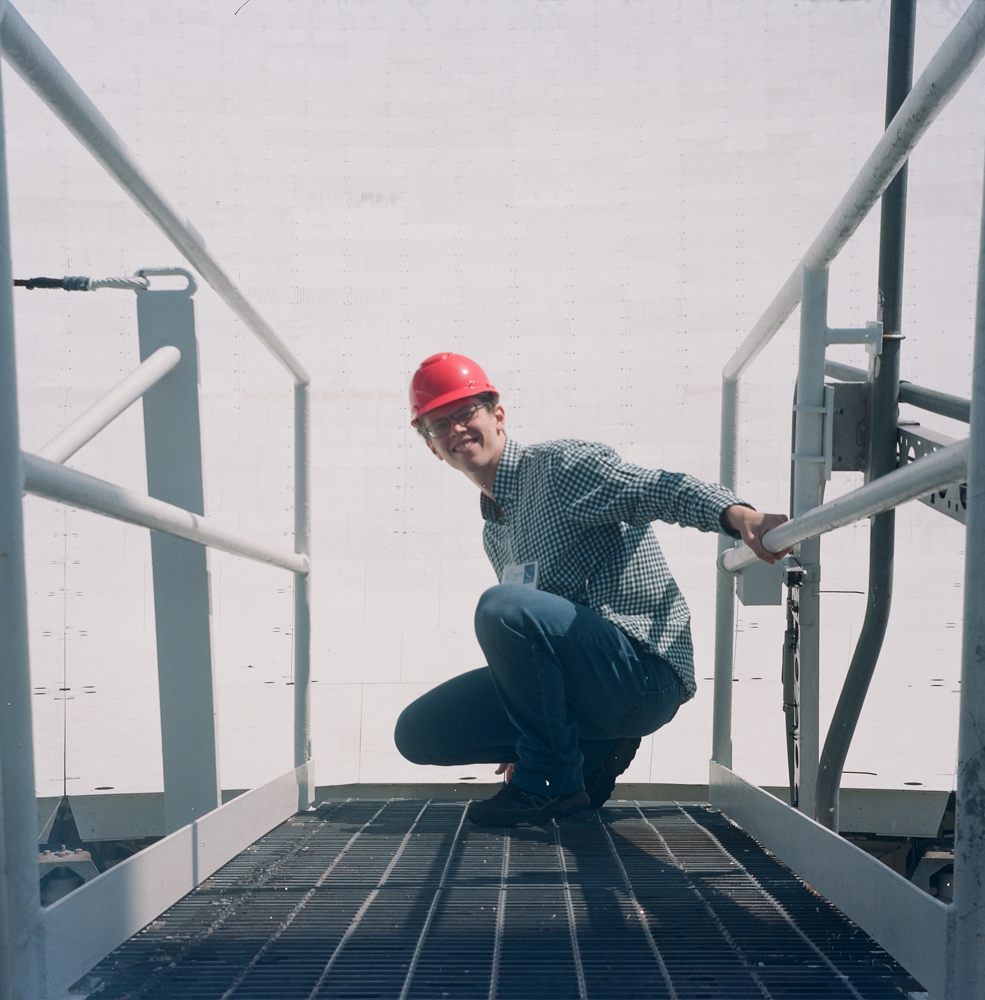

---

* Current email: michael.barth [at] umontreal.ca

---

## Aliases
My first name, Michael, is informally translated into Russian as Misha. I also use my mother's maiden name in my last name to differentiate me from other Barth astronomers (no relation). Hence, many people know me as 
1. Misha Barth
2. Michael Barth
3. Misha Yantovski-Barth
4. Unhyphenated versions of my name, etc. 

---

## Links

1. [GitHub](https://github.com/mjyb16)
2. [ORCiD](https://orcid.org/0000-0001-5200-4095)
3. [Ciela Institute](https://ciela.science/)
