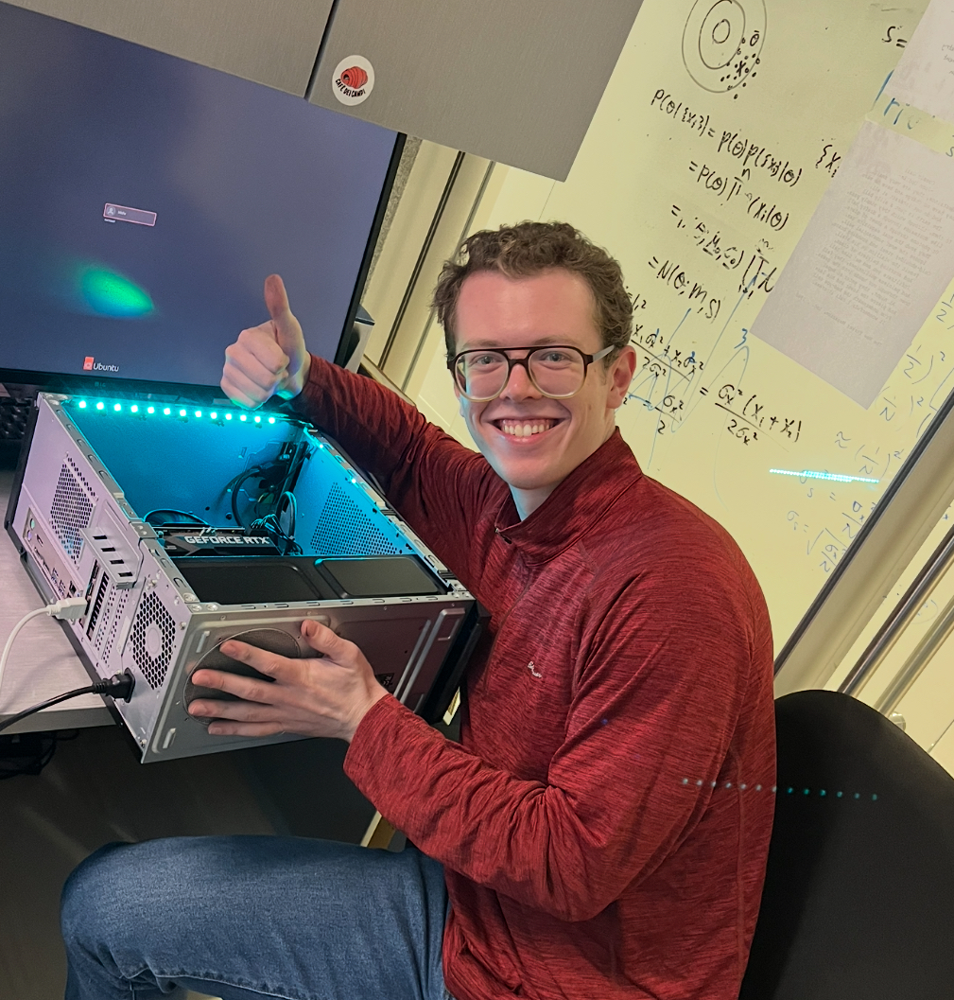

## About Me

I am currently a PhD student in astrophysics at the Ciela Institute of the University of Montreal. Previously, I was an undergraduate student at the University of Pittsburgh, during which time I was fortunate to participate in an NSF REU at the National Radio Astronomy Observatory.

## Research Interests
Our understanding of the dark side of the universe, from black holes to dark matter and dark energy, has historically been limited by the dark sector's electromagnetic invisibility and the maze of complex physics interactions that occur between the visible and invisible parts of the universe. From a broad perspective, my research goals are to develop new modeling methodologies to bridge this gap between the complexity of the universe as captured in telescope data and the practical need for interpretable, testable mathematical models for what we observe. 

My current research focus is centered on galactic dynamics in the vicinity of supermassive black holes. I am developing new techniques for high-resolution dynamical mass modeling which can be applied both to local galaxies and to highly-magnified gravitationally lensed galaxies in the early universe. 

As a multiwavelength astronomer, I have worked with both optical and radio wave data. However, these days I primarily work with radio interferometers such as ALMA due to their exquisite spatial resolution. As a result, a large part of my research is focused on UV-plane modeling and interferometric imaging techniques. 

## Publications

For a full list, please go [here](https://ui.adsabs.harvard.edu/search/q=author%3A%22Yantovski-Barth%2C%20M.%20J.%22&sort=date%20desc%2C%20bibcode%20desc&p_=0)
Here are some highlights:

1. F.Bar, J.Doe: Effects of having a placeholder of a name
2. F.Bar, J.Doe: Effects of having a placeholder of a name

## Software Packages and Tools

Here is a quick table of various open-source software packages whose development I have led (*) or been heavily involved in as a developer (^). Projects whose code I am presently involved in actively maintaining are in bold. I primarily work with Python code. 

Software name | Collaboration | Description
--------------|-------------------|--------
[**Caustics**](https://caustics.readthedocs.io/en/latest/intro.html#) | Ciela Institute^ | Gravitational lensing modeling (GPU-accelerated)
[Iris](https://github.com/EnceladeCandy/IRIS) | Ciela Institute^ | Interferometric imaging using diffusion model-based Bayesian priors

---

> The measure of greatness in a scientific idea is the extent to which it stimulates thought and opens up new lines of research.

― Paul Dirac

