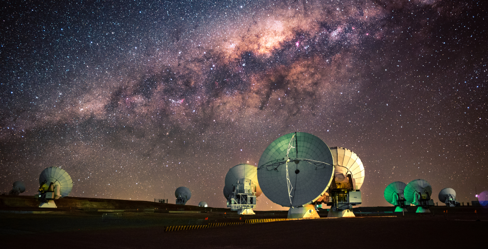

#### The dark side of the universe is a pathway to physics some consider to be…unnatural. 
#### Welcome to the personal website of Michael James Yantovski-Barth!

Image credit: NSF/ AUI/ NSF NRAO/ B.Foott
---

## About Me

I am currently a PhD student in astrophysics at the [Ciela Institute](https://ciela.science/team/michael-j-barth/) of the University of Montreal and [Mila](https://mila.quebec/en/directory/misha-barth). Previously, I was an undergraduate student at the University of Pittsburgh, during which time I was fortunate to participate in an NSF REU at the National Radio Astronomy Observatory.

My research focuses on the dark side of the universe: supermassive black holes, gravitational lensing, dark matter, and other aspects of the cosmos which are governed by mysterious forces. I am primarily an observational astronomer: my preferred method of intergalactic travel is by radio interferometer telescope (pictured above: ALMA). You can read more about my work under the [Research](https://darthbarth.science/research) tab. 

I spend most of my working hours writing computer code. A list of the software projects I have been involved in can be found under the [Software](https://darthbarth.science/software) tab. In my spare time, I enjoy hiking, mountain biking, skiing, and playing musical instruments (cello, mandola, and guitar). In a past life, I was also a student of the humanities (Russian, to be exact), which is how I learned to make websites like this one and also [this one](http://soviet-rock.obdurodon.org/). 

---

> The measure of greatness in a scientific idea is the extent to which it stimulates thought and opens up new lines of research.

― Paul Dirac

