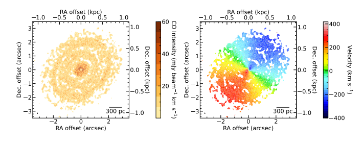
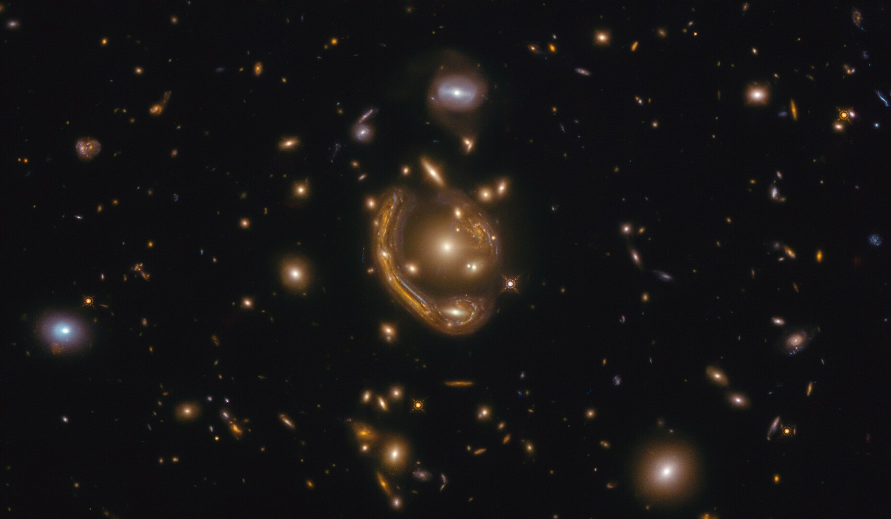
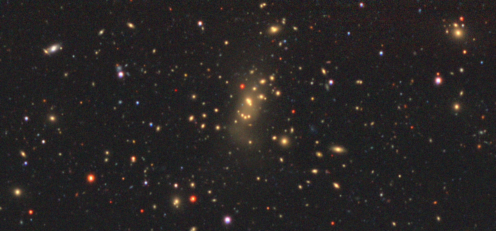

## Publications

For a full list, please go [here](https://ui.adsabs.harvard.edu/search/q=author%3A%22Yantovski-Barth%2C%20M.%20J.%22&sort=date%20desc%2C%20bibcode%20desc&p_=0).
Here are some highlights:

1. Connor Stone, Alexandre Adam, Adam Coogan, M. J. Yantovski-Barth, et al., Journal of Open Source Software, 9(103), 7081, 22 November 2024. [Caustics: A Python Package for Accelerated Strong Gravitational Lensing Simulations](https://ui.adsabs.harvard.edu/abs/2024JOSS....9.7081S/abstract)
2. M. J. Yantovski-Barth, Jeffrey Newman, et al., MNRAS, 531, 2, Jun 2024. [The CluMPR Galaxy Cluster-Finding Algorithm and DESI Legacy Survey Galaxy Cluster Catalogue](https://ui.adsabs.harvard.edu/abs/2024MNRAS.531.2285Y/abstract)

## Research Interests
Our understanding of the [dark side of the universe](https://www.symmetrymagazine.org/article/voyage-into-the-dark-sector?language_content_entity=und), from black holes to dark matter and dark energy, has historically been limited by the dark sector's electromagnetic invisibility. Astronomers who attempt to indirectly study the dark sector are further challenged the maze of complex physics interactions that occur between the visible and invisible parts of the universe. From a broad perspective, my research goals are to develop new modeling methodologies to bridge this gap between the complexity of the universe as captured in telescope data and the practical need for [mathematical models](https://en.wikipedia.org/wiki/All_models_are_wrong) of what we observe. 

<figure>
  
  <figcaption style="font-size: 12px; width: 75%">An image of gas in galaxy NGC383 and a map of its rotational velocity. Image credit: Hengyue Zhang.</figcaption>
</figure>

My current research focus is centered on galaxy dynamics in the vicinity of [supermassive black holes](https://en.wikipedia.org/wiki/Supermassive_black_hole). The orbital motions of [molecular gas](https://en.wikipedia.org/wiki/Interstellar_cloud) trace the galactic gravitational potential well as a function of radius, which allows us to measure the mass of supermassive black holes. I am developing new techniques for high-resolution dynamical mass modeling which can be applied both to [nearby galaxies](https://en.wikipedia.org/wiki/NGC_4697) and to highly-magnified [gravitationally lensed galaxies](https://en.wikipedia.org/wiki/Strong_gravitational_lensing) in the early universe. By making precision measurements of supermassive black hole masses across cosmic time, we can learn more about their [mysterious formation and evolution](https://en.wikipedia.org/wiki/Supermassive_black_hole#Formation). 

<figure>
  
  <figcaption style="font-size: 12px; width: 75%">Background galaxies are distorted and magnified by the foreground galaxies which act as a gravitational lens. Image credit: ESA/Hubble</figcaption>
</figure>

As an observational astronomer, at this time I primarily work with [radio interferometers](https://en.wikipedia.org/wiki/Atacama_Large_Millimeter_Array) due to their exquisite spatial resolution. The challenge with working with radio interferometers is that they do not directly take pictures of the sky; the data they collect is an incomplete [Fourier](https://en.wikipedia.org/wiki/Fourier_transform) transform of the sky. As a result, a large part of my research is focused on [uv-plane](https://en.wikipedia.org/wiki/Spatial_frequency) modeling and related interferometric imaging techniques. 

<figure>
  
  <figcaption style="font-size: 12px; width: 75%">Timelapse of the ALMA radio interferometer's nightly observations. Image credit: ESO/B. Tafresh</figcaption>
</figure>

The recent Cambrian explosion of [generative neural networks](https://en.wikipedia.org/wiki/Generative_model#Deep_generative_models) has opened up new data-driven statistical modeling approaches which can be applied to astronomy. Furthermore, the rise of GPUs in scientific computing applications has opened new horizons of complexity and data volume. In light of this, my research is closely connected to advances in machine learning and supercomputing.

<figure>
  
  <figcaption style="font-size: 12px; width: 75%">Image of a galaxy cluster. Image credit: M. J. Yantovski-Barth</figcaption>
</figure>

In the past, I have also worked on developing algorithms to discover [galaxy clusters](https://en.wikipedia.org/wiki/Galaxy_cluster) in large-scale [imaging surveys](https://en.wikipedia.org/wiki/Astronomical_survey) of the night sky. Galaxy clusters are the most massive objects in the universe; such extreme concentrations of matter are a useful tool for pushing the limits of astrophysical theories and observations. Each year, as we observe ever-more-distant galaxies, the boundaries of our knowledge expand to new, previously unexplored corners of the universe. 
