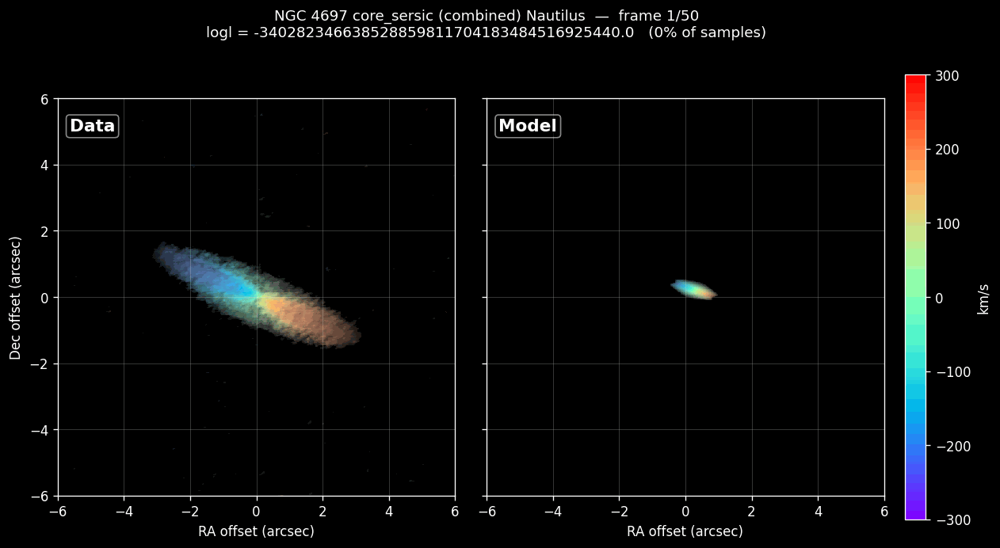
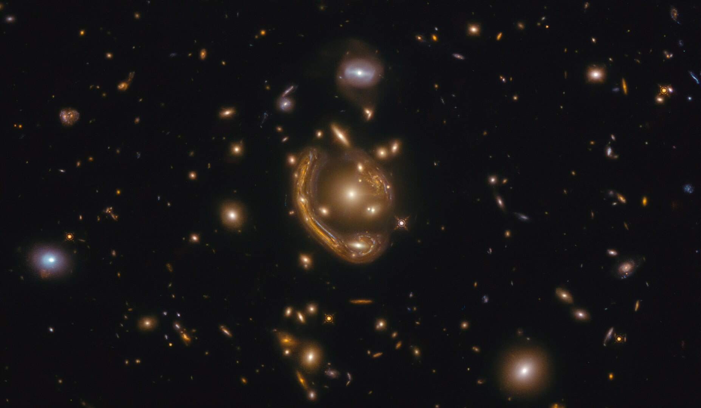
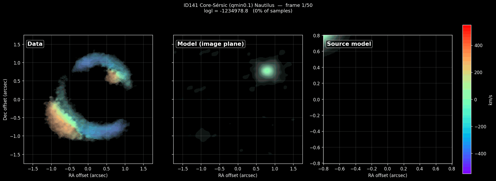
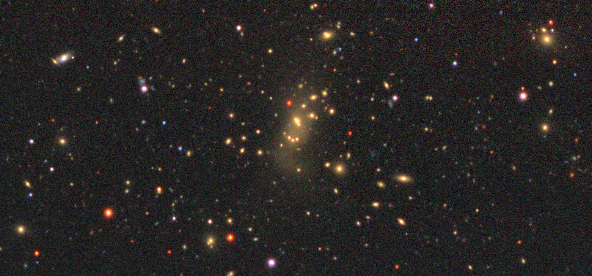

## Publications

For an annotated publication list, please see the last page of my [CV](https://darthbarth.science/CV_MICHAEL_YANTOVSKI_BARTH.pdf).

For a full list, please go to my publications on ADS [here](https://ui.adsabs.harvard.edu/search/q=author%3A%22Yantovski-Barth%2C%20M.%20J.%22&sort=date%20desc%2C%20bibcode%20desc&p_=0) or on arxiv [here](https://arxiv.org/search/astro-ph?query=Yantovski-Barth&searchtype=author&abstracts=show&order=-announced_date_first&size=50).

## Research Interests

Our understanding of the [dark side of the universe](https://www.symmetrymagazine.org/article/voyage-into-the-dark-sector?language_content_entity=und), from black holes to dark matter and dark energy, has historically been limited by the dark sector's electromagnetic invisibility. Astronomers who attempt to indirectly study the dark sector are further challenged by the maze of complex physics interactions that occur between the visible and invisible parts of the universe. From a broad perspective, my research goals are to develop new modeling methodologies to bridge this gap between the complexity of the universe as captured in telescope data and the practical need for [mathematical models](https://en.wikipedia.org/wiki/All_models_are_wrong) of what we observe.

<figure>
  
  <figcaption class="long-caption" style="width: 100%">Fitting a model for the spinning gas disk in galaxy NGC 4697. The gas disk is modeled with the [SuperMAGE](https://github.com/mjyb16/supermage) simulator. By generating simulator outputs for multiple plausible sets of model parameters and then comparing them to the data (guided by sampling algorithms such as [Nautilus](https://github.com/johannesulf/nautilus)), we can survey the range of possibilities for the black hole mass at the center of the galaxy. The search process starts with a broad survey of all parameters (including some that even move the galaxy beyond the edges of this video), and then as the sampler learns what values of the parameters are reasonable, it is able to narrow down the range and produce a galaxy that looks like the data.</figcaption>
</figure>

My current research focus is centered on galaxy dynamics in the vicinity of [supermassive black holes](https://en.wikipedia.org/wiki/Supermassive_black_hole). The orbital motions of [molecular gas](https://en.wikipedia.org/wiki/Interstellar_cloud) trace the galactic gravitational potential well as a function of radius, which allows us to measure the mass of supermassive black holes with high accuracy for a wide variety of galaxy types. I am developing new techniques for high-resolution dynamical mass modeling which can be applied both to [nearby galaxies](https://en.wikipedia.org/wiki/NGC_4697) and to highly-magnified [gravitationally lensed galaxies](https://en.wikipedia.org/wiki/Strong_gravitational_lensing) in the early universe. By making precision measurements of supermassive black hole masses across cosmic time, we can learn more about their [mysterious formation and evolution](https://en.wikipedia.org/wiki/Supermassive_black_hole#Formation).

<figure>
  
  <figcaption style="width: 75%">Background galaxies are distorted and magnified by the foreground galaxies which act as a gravitational lens. Image credit: ESA/Hubble</figcaption>
</figure>

<figure>
  
  <figcaption class="long-caption" style="width: 100%">Fitting a model for the spinning gas disk in the gravitationally-lensed galaxy ID 141. The light from this galaxy is distorted into two curved and magnified images due to the gravity of two other galaxies (invisible in this data) which bends light rays as they pass by. The gas disk is modeled with [SuperMAGE](https://github.com/mjyb16/supermage), and the effect of gravitational lensing is modeled with [Caustics](https://github.com/Ciela-Institute/caustics). Just as for galaxy NGC 4697 above, we can use sampling algorithms to survey the range of possibilities for what this galaxy would look like without the distortion of gravitational lensing (right panel) and thereby derive the range of black hole masses that are consistent with the data.</figcaption>
</figure>

As an observational astronomer, at this time I primarily work with [radio interferometers](https://en.wikipedia.org/wiki/Atacama_Large_Millimeter_Array) due to their exquisite spatial resolution. The challenge with working with radio interferometers is that they do not directly take pictures of the sky; the data they collect is an incomplete [Fourier](https://en.wikipedia.org/wiki/Fourier_transform) transform of the sky. As a result, a large part of my research is focused on [uv-plane](https://en.wikipedia.org/wiki/Spatial_frequency) modeling and related interferometric imaging techniques.

<figure>
  
  <figcaption style="width: 75%">Timelapse of the ALMA radio interferometer's nightly observations. Image credit: ESO/B. Tafresh</figcaption>
</figure>

The recent Cambrian explosion of [generative neural networks](https://en.wikipedia.org/wiki/Generative_model#Deep_generative_models) has opened up new data-driven statistical modeling approaches which can be applied to astronomy. Furthermore, the rise of GPUs in scientific computing applications has opened new horizons of complexity and data volume. Since the morphology of galaxies is complex and consists of several interacting components (gas, stars, dark matter, black holes), it is important to model each component as accurately as possible and also quantify the uncertainty in our measurements of each component. In light of this challenge, I am currently working on developing flexible, data-driven models for galaxy components using neural networks which can be sampled statistically (for example, diffusion models and variational autoencoders).

<figure>
  
  <figcaption style="width: 75%">Image of a galaxy cluster. Image credit: M. J. Yantovski-Barth</figcaption>
</figure>

In the past, I have also worked on developing algorithms to discover [galaxy clusters](https://en.wikipedia.org/wiki/Galaxy_cluster) in large-scale [imaging surveys](https://en.wikipedia.org/wiki/Astronomical_survey) of the night sky. Galaxy clusters are the most massive objects in the universe; such extreme concentrations of matter are a useful tool for pushing the limits of astrophysical theories and observations. Each year, as we observe ever-more-distant galaxies, the boundaries of our knowledge expand to new, previously unexplored corners of the universe.

